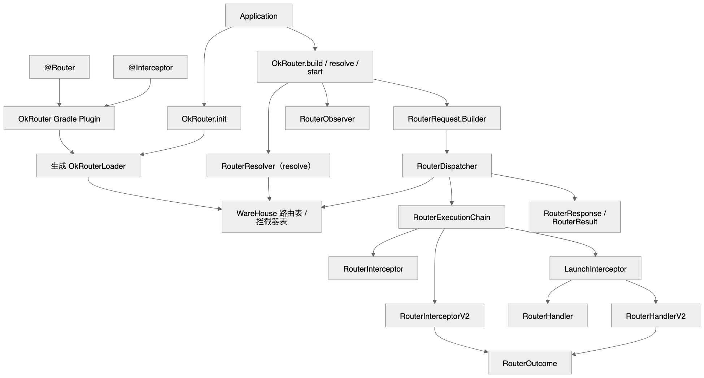
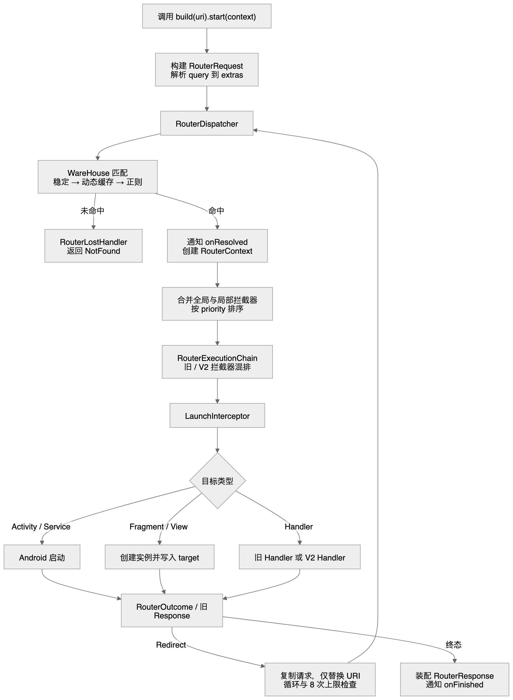

# OkRouter 架构说明

OkRouter 以“构建时发现，运行时查表”为核心。应用构建时插件读取注解并生成 `OkRouterLoader`；运行时只加载生成表、匹配 URI、执行拦截器和目标分发。这样避免了在启动后扫描全部 classpath。

## 模块职责

| 模块 | 职责 |
|---|---|
| `okrouter` | 对外 API、运行时匹配、拦截器链和 Android 目标启动。 |
| `okrouter-stub` | `OkRouterLoader` 的编译时占位声明，运行时由插件生成实现替代。 |
| `okrouter-plugin` | 扫描 `@Router` / `@Interceptor` 并生成 Loader 与路由文档。 |
| `example/*` | 多模块接入、登录拦截、正则 Web Handler 等可运行样例。 |

## 类关系

可编辑源码：[Mermaid](../diagrams/okrouter-class-relations.mmd) · [Excalidraw](../diagrams/okrouter-class-relations.excalidraw) · [SVG](../diagrams/okrouter-class-relations.svg)

## 构建期

1. application 模块应用 `OkRouterTransformPlugin`。
2. 每个 variant 的 `OkRouterRegister<Variant>` 在 Java 编译后扫描 classpath。
3. 插件读取 `@Router`、`@Interceptor`，验证别名引用，区分稳定与正则路由。
4. 插件用 JavaPoet 生成 `OkRouterLoader`，在静态块中调用 `WareHouse.register*`。
5. `OkRouterCompile<Variant>` 编译生成源码，并让 assemble 的下游任务消费该 classes 输出。

构建期生成意味着注解只在构建时被读取；运行时不进行包扫描。

## 路由执行流程

可编辑源码：[Mermaid](../diagrams/okrouter-route-flow.mmd) · [Excalidraw](../diagrams/okrouter-route-flow.excalidraw) · [SVG](../diagrams/okrouter-route-flow.svg)

### 稳定路由、正则路由与缓存

`WareHouse` 会先将 URI 去掉 query 与 fragment，再按以下顺序匹配：

1. `stableRouters`：完全匹配。
2. `dynamicRouters`：此前命中过的正则结果。
3. `regexRouters`：按 `priority` 升序、规则字符串升序逐一尝试。

真实 `start` 对正则命中写入 `dynamicRouters`，下次无需重复正则计算。公开 `resolve` 则走只读匹配，不写此缓存。这是为了同时满足执行性能和预检无副作用。

### 新旧拦截器的兼容边界

运行时将全局拦截器和 `@Router` 局部拦截器合并排序，并在末尾追加 `LaunchInterceptor`。`RouterExecutionChain` 根据实际类型调用旧 `RouterInterceptor` 或 `RouterInterceptorV2`：

- 旧接口返回 `RouterResponse`；框架在执行作用域中保留完整旧响应，以保持 headers、target、`Custom` 等无法完全表示为 `RouterOutcome` 的信息。
- V2 接口返回 `RouterOutcome`；可以短路、失败或请求重定向。
- 旧拦截器调用 `proceed()` 后如遇 V2 `Redirect`，该 Redirect 会透传到 `RouterDispatcher`，不会被转换为中间响应。

代价是执行模型需要一层适配，但收益是现有业务不必迁移，新增业务可以渐进使用结构化结果。

### 重定向与观察

Dispatcher 为每次实际跳转保留原始 URI 和已访问的规范化 URI。它在 8 次重定向后拒绝下一跳，并把 query / fragment 不同但路径相同的跳转识别为循环。重定向通过复制原 `RouterRequest` 后只替换 URI 来保留调用配置。

`RouterObserver` 是旁路：解析成功或执行结束时触发；观察者及日志器异常都会吞掉。这使监控代码无法阻断用户导航，代价是观察者不能作为业务控制点。

## 设计取舍

| 选择 | 解决的问题 | 代价 |
|---|---|---|
| 编译期生成 Loader | 避免运行时扫描与反射发现注解。 | application 模块必须应用插件。 |
| 字符串 URI 保持兼容 | 多模块已有路由无需迁移。 | 缺少编译期路径拼写检查。 |
| `resolve` 只读 | 预检、埋点不会改变后续执行状态。 | 它不能证明目标最终一定会启动。 |
| V2 Outcome 与旧响应适配 | 允许渐进升级 Handler / 拦截器。 | 内部链路更复杂，需要兼容测试保护。 |
| 限制重定向 | 防止无限递归和栈风险。 | 超过 8 跳的业务需自行改为状态机或统一入口。 |

`RouteSpec` 等类型化路由声明仍是后续 TODO；当前版本的正式入口仍是字符串 URI。
